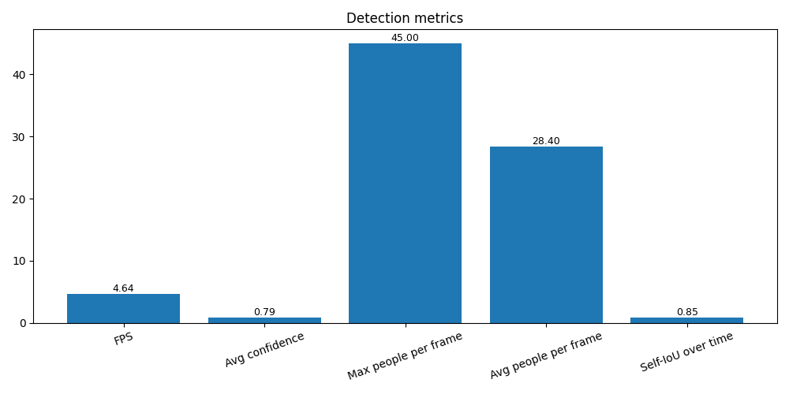

# Детекция людей на видео

Проект для автоматического обнаружения и отслеживания людей на видеопотоке с использованием нейросетевых моделей Yolo и Faster RCNN.

## Руководство по эксплуатации

* установите окружение 

`pip install -r requirements.txt`

* из корневой папки запустите main.py . Файл для распознования должен лежать в папке `source` с именем `crowd.mp4`

```
python main.py
```

* Выберете модель (для выхода ввести `42`)
  * `1` - Yolo
  * `2` - Faster RCNN 

* результат будет сохранен в папке `result`/ выбранная модель/ . 

## Результаты

| YOLO                                                    | Faster RCNN                                                                 |
|:--------------------------------------------------------|:----------------------------------------------------------------------------|
|  |  |

